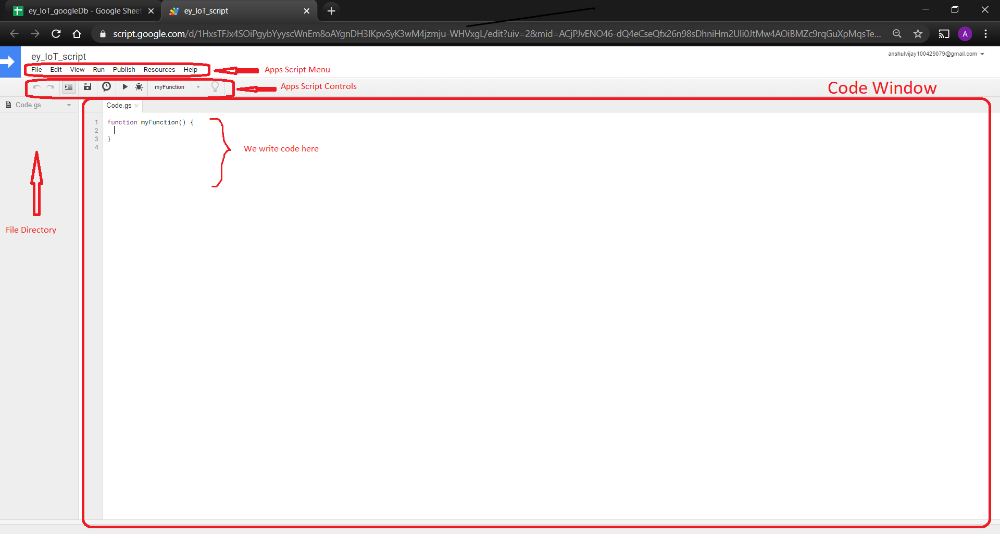
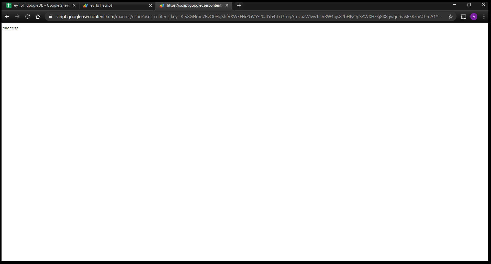

# Setting up Google Spreadsheet

First of all, users need a google account in order to proceed. If you do not have it already, kindly create one.

Open Google Sheets:  [Google Sheets](https://www.google.com/sheets/about/)

Create a blank sheet and name it as per your choice. Here we have named it as  **Sensor_1** .  Note the difference between the complete spreadsheet name which is **ey_IoT_googleDb** in this case and individual sheet name which is **Sensor_1**.

Write headings for two columns, *Timestamp*, *value* .  *Timestamp* indicates the date and time at which sensor readings will be updated in the subsequent columns. This column will be updated automatically when a reading is send to the sheet via an HTTP GET request. *value* is the reading itself. We can have multiple values columns for multiple sensor readings which is explained further in this document.


Go to *Tools* -> *Script editor*.  to open a new tab with the code editor window.

This will open a new tab in your browser, which is the Google Apps Script editor window:

Here, we will be writing some script (see https://developers.google.com/apps-script) for extending our sheet’s functionality. The script will be processing HTTP GET (more at https://en.wikipedia.org/wiki/Hypertext_Transfer_Protocol) requests and forwarding the data passed as parameters to the sheet, and plots live sensor readings on chart.



By default, it’ll open with a single Google Script file (`code.gs`) and a default code block, `myFunction()`:

For this project, you will have two files: Code.gs and Index.html .

Copy and paste below mentioned code in Code.gs file.

```javascript
function doGet(e){
  // open the spreadsheet
  var ss = SpreadsheetApp.getActive();
  
  // use the 'id' parameter to differentiate between sheet
  var sheet = ss.getSheetByName(e.parameter["id"]);
  
  // extract headers
  // getRange accepts row, col, number_of_rows and num_of_cols as argument
  // getLastColumn returns the position of the last column that has content
  var headers = sheet.getRange(1, 1, 1, sheet.getLastColumn()).getValues()[0];
  
  // store the position of the last row
  var lastRow = sheet.getLastRow();
  
  var cell = sheet.getRange('a1');
  var col = 0;
  var d = new Date();
  
  for (i in headers){
    
    // loop through the headers and if a parameter name matches the header name insert the value
    if (headers[i] == "Timestamp")
    {
      val = d.toDateString() + ", " + d.toLocaleTimeString();
    }
    else
    {
      val = e.parameter[headers[i]]; 
    }
    
    // append data to the last row
    cell.offset(lastRow, col).setValue(val);
    col++;
  }
  
  //Checks the last logged data in the sheet, sends email if data greater is than threshold
  
  var sh = SpreadsheetApp.getActiveSpreadsheet().getActiveSheet();
  var lastRow = sh.getLastRow();
  var lastCol = sh.getLastColumn();
  var data = sh.getRange(lastRow, lastCol).getValue();
  if(data > 100)     //set your threshold here
  {
    var to = "abc@gmail.com";   //write your email id here
    var message = "Warning! Temperature has crossed the threshold value. Right now, the temperature is " + data + " \n" ; 
      
    MailApp.sendEmail(to, " alert! ", message);
  }
  ////////////
  
  return ContentService.createTextOutput('success');
}

// function to create menu
function onOpen() {
  SpreadsheetApp.getUi() // Or DocumentApp or SlidesApp or FormApp.
      .createMenu('Live plot') //Name of the created menu in the spreadsheet. 
      .addItem('Chart', 'openDialog')
      .addToUi();
}
// function that calls html file to display in dialog box
function openDialog() {
  var html = HtmlService.createHtmlOutputFromFile('Index') //HTML file name
  .setWidth(1000) //you can change dimensions of dialog box from here
  .setHeight(700)
  
  SpreadsheetApp.getUi() // Or DocumentApp or SlidesApp or FormApp.
      .showModalDialog(html, 'Chart');
}

```

## Changes to be made in Code.gs: 

- Change threshold value as per your requirement. 
- Give the mail id on which you want to receive email.
- The text message, which will be mailed to the specified mail id when threshold readings are violated, can also be altered as per user's requirement.  


Now we will be creating a html file . To create a html file , from the script editor window itself, Go to 

*File* -> *New* ->*HTML file* . 

Name that file as 'Index' , copy and paste the below mentioned code in that file .    

```html

<!DOCTYPE html>
<html>
<head>
    <title>Line Chart with Google Sheets</title>
    <meta name="viewport" content="width=device-width, initial-scale=1.0">
    <meta charset="utf-8">
    <!-- load jQuery -->
    <script src="https://code.jquery.com/jquery-3.1.1.min.js"
    integrity="sha256-hVVnYaiADRTO2PzUGmuLJr8BLUSjGIZsDYGmIJLv2b8="
    crossorigin="anonymous"></script>
    <!-- load Highcharts, Highcharts-more, and modules -->
    <script src="https://code.highcharts.com/highcharts.js"></script>
    <script src="https://code.highcharts.com/highcharts-more.js"></script>
    <script src="https://code.highcharts.com/modules/data.js"></script>
    <script src="https://code.highcharts.com/modules/exporting.js"></script>
    <script src="https://code.highcharts.com/modules/boost.js"></script>

</head>
<body>
<div id="container" style="width:100%; height:600px;"></div>
<script>
  $(function() {
Highcharts.chart('container', {

      chart: {
        zoomType: 'x'
    },

    title: {
        text: 'Real Time Plot of Sensor values'
    },
 
    data: {
        
        googleSpreadsheetKey: '1zZ****************************0Y', // add your google spreadsheet key here
        enablePolling: true,
        dataRefreshRate: 1
    },
      
});
});
</script> 
</body>
</html>


```
## Changes to be made in Index.html

- Change **googleSpreadsheetKey**

  Go to your spreadsheet, and check its URL, it would be something like

  ```
  https://docs.google.com/spreadsheets/d/{googleSpreadsheetKey}/edit#gid=0
  ```

  Extract **googleSpreadsheetKey** from URL and edit in **Index.html** .


After all editing in the code,  Go to *Publish* -> *Deploy as web app* . You will get dialog box as below.

Make the app accessible to *Anyone* . Execute the app as *Me* and click on *Deploy*.


 

Then *Authorization required* dialog box will appear. Click on *Review Permissions* .


Choose your Google account.

Then Google will asks for verification and you will be getting a window like given below. So click on ***Advanced*** .


Scroll down and click on ***Go to ey_IoT_script (unsafe)*** .

Then click on ***Allow*** . You will get a dialog box like this below. 


 Copy the link that is provided to you, at this step , and click on ***OK***

The link will look like this,

```
https://script.google.com/macros/s/{your-sheet-id}/exec
```

In the previous code, I mentioned about parameters. I am using the parameter *id* to differentiate between sheets. At the same time, if a parameter name matches with a header name, the script would be writing to that column. The header in my sheet, other than *Timestamp* is *value* . So would be the parameters.

A sample URL containing the query parameters is,

```
https://script.google.com/macros/s/{your-sheet-id}/exec?id=Sensor_1&value=100
```

**Note :** Headers in the spreadsheet (**value** in this case) and the query parameters in your URL must be same. 

Also *id* is nothing but name of the sheet which in this case is Sensor_1.

When the URL is pasted in the address bar of the browser and invoked,


Something happened. Maybe, check our sheet.


Whoa! . You have successfully added a data in the sheet.


Now if you observe, *Live plot* option is added in the menu bar. This is because when we run that above mentioned URL , google script that we wrote is executed. That script includes the code to fill data in the sheet and adds a menu in the menu bar in where you can see the live plot of your sensor values.

Now before you observe the graph in the *Live plot* menu , you need to publish your Google spreadsheet as well.

Change the sharing setting of your sheet. Change your settings to ***Anyone with the link***.

Now Go to *File* -> *Publish to the web* . 


Click on publish .

So, now you can observe the real time plot of your sensor values in the *Live plot* menu. 


So just like above image a graph with the plotted values will be seen. X axis is the first column timestamp and Y axis are the sensor readings. Since only one column is there only one reading is present. 

You may have observed that the readings appear pretty squeezed between certain intervals. To make them visible distinctly we can zoom on the graph. To do that, drag the cursor across the region which you want to zoom and the same interval will be visible as shown in image below.


Notice the difference between the 20 Jun region before and after. This process of zooming can be repeated several times until the single readings are distinctly visible. To view the normal graph again and to exit zoom press the 'Reset Zoom' button. 

The graph can be viewed in full screen, can be converted into various image formats or printed as well. For that press the menu on top right side and a dialog box as shown below will appear. User can select suitable option from that. 


## What if you wanted to upload more than one sensor readings to spreadsheet?

In the tutorial above, you have come across to upload one sensor reading named ***'value'*** to the spreadsheet. Now if you wanted to upload more than one sensor readings to the spreadsheet, what would you do?

Let's say you wanted to upload 3 sensor readings  named ***value1*** , ***value2*** , ***value3***  to the spreadsheet. Just follow below mentioned steps.

**Step 1 :**   In the same spreadsheet, make 3 headers in your sheet other than ***Timestamp*** as ***value1*** , ***value2*** ,  ***value3***   .


**Step 2 :** Code.gs and Index.html will be same. All procedure will be same as we did above. 

**Step 3 :**  Now recall the URL that you get when you published your script and deployed it as web app.

It was something like this:-

```
https://script.google.com/macros/s/{your-sheet-id}/exec
```

In the code.gs , I mentioned about parameters. I am using the parameter *id* to differentiate between sheets. At the same time, if a parameter name matches with a header name, the script would be writing to that column. The header in my sheet, other than ***Timestamp*** is  ***value1*** , ***value2*** , ***value3*** . So would be the parameters.

A sample URL containing the query parameters is,

```
https://script.google.com/macros/s/{your-sheet-id}/exec?id=Sensor_1&value1=100&value2=50&value3=100
```

**Note :** Headers in the spreadsheet (**value1** , **value2** , **value3** in this case) should be same as query parameters in your URL.

When the URL is pasted in the address bar of the browser and invoked,



Something happened. Maybe, we should check our sheet?


Whoa! . You have successfully uploaded 3 sensors readings on the sheet.

So in this way, you can upload as many sensor readings you want to the spreadsheet by just changing the headers in the sheet and some query parameters in the URL.


That's all for this section. Thank you!

  

