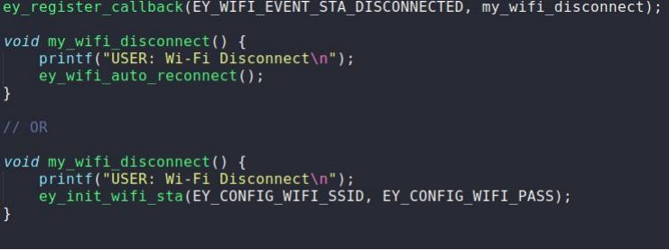
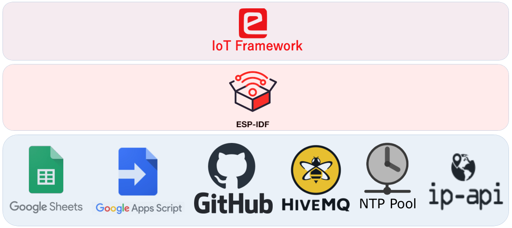
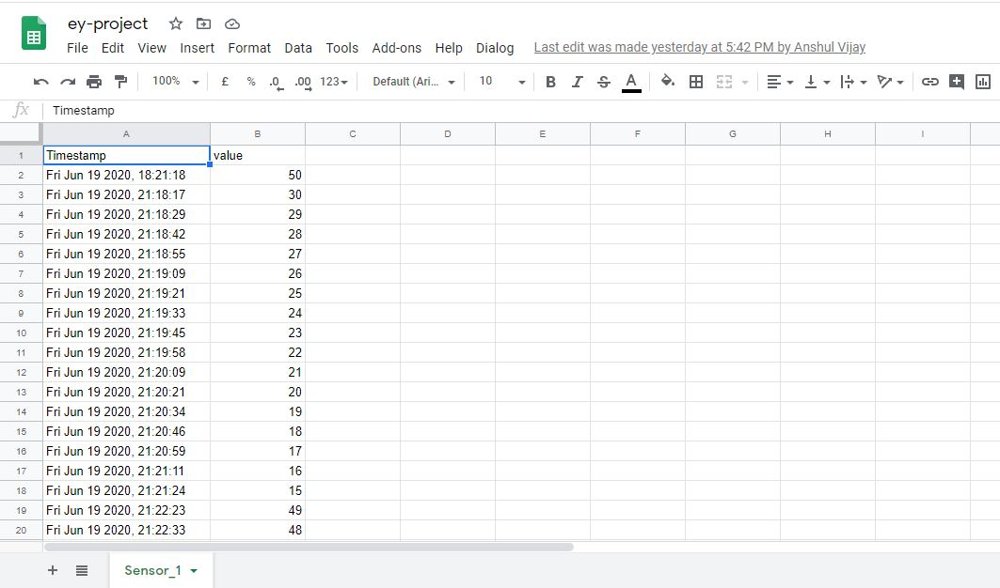
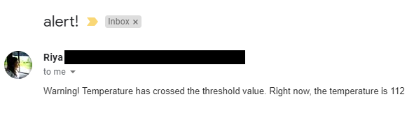
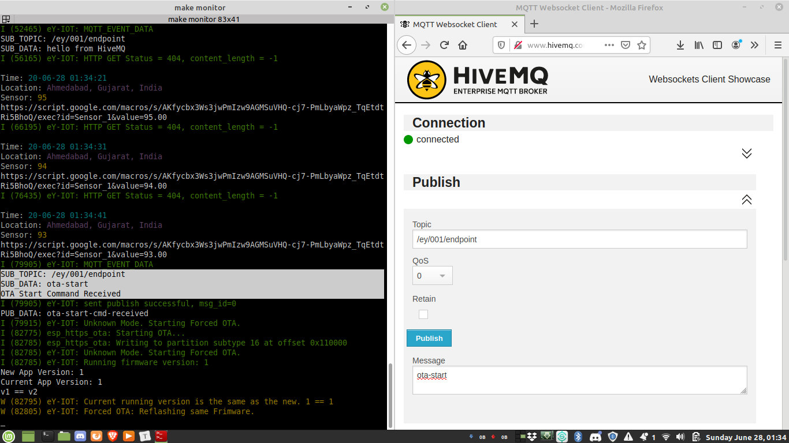
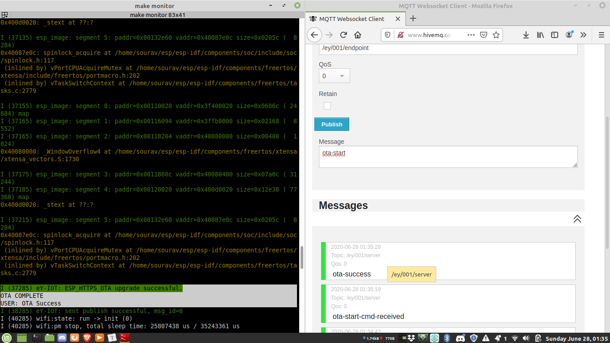
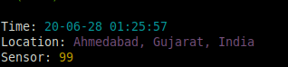

<h1>e-Yantra IoT Framework</h1>

 

## Project Overview 

Our project, ***'e-Yantra IoT Framework'*** attempts on creating a framework specifically designed to carry out IoT based applications with ease and without much hassle. 

So, what makes this framework unique! For starters, the entire framework is based on tools and services which are available for free which in turn make this framework completely free.

 

#### Event Driven Programming

In this framework **emphasis is given on Event-Driven Programming over Sequential Programming.** This is because, IoT applications are an event driven system and using sequential programming techniques to develop event driven systems is hard and does not make much sense.

The framework consists of APIs which users can use in the code as per their need. All the user will have to do is to write user defined functions and attach it to the set of events defined in the framework. So, whenever any IoT event occurs the user defined function attached to that event will be executed automatically without having the user call the function explicitly in main() or elsewhere.

Further information and usage details of these APIs will be discussed in the further sections in depth. 

 

#### Why use eY IoT Framework?

There are frameworks like Azure IoT, AWS IoT, etc already designed for similar IoT based applications but what makes this framework stand apart from them is the fact that since this framework is entirely based on free tools and services it itself becomes **free for use**. On the other hand, the **existing frameworks offer paid services.** 

Secondly, people who are just starting out in the IoT field are already unfamiliar with many concepts and are in the learning phase. At that time if they are made to get acquaint with **frameworks having steep learning curves**, that in itself **can act as a demotivation**. This framework uses tools which many may have already used apart from IoT applications like Github and Google Spreadsheet. Usage of such tools and overall design makes this framework very **user-friendly and simple**!  

*So with this free, easy to use framework we wish to ease out on your load while developing IoT applications and we hope it fulfils this purpose with a great deal of satisfaction! :)*   

 

 

## Technology Stack

The tools and services we have used in the framework are as follows:	

- Google Spreadsheet as database.  
- Google App Scripting for generating alert notifications.
- HiveMQ, a public MQTT server.
- Github is used to store firmware on cloud to perform remote OTA. 
- Public NTP server pool.ntp.org for timekeeping.
- ip-api.com for IP based Geo-location.

So, what activities will a user be able to carry out with this developed framework. Let's take a look...

 

## Database: Google Sheets

* An ESP32 based endpoint like eYFi-Mega, connected to the internet can **directly push sensor data to Google Spreadsheet** using this framework.
* Google Sheets has upper limit of 5 Million rows. So, if you are logging sensor data at an interval of 1 minute then Google Sheets will allow you to log data for **9 years**!!
* Google Sheets is very powerful tool which can allow user to **make sense out of their IoT Data** which is also a crucial part of IoT.

 

## Alert Notifications: Google Apps Scripting

* The framework offers a facility of **alerting the user via an e-mail** if the sensor readings exceed a certain pre-defined threshold.
* Our Google Apps Script attached to Google Sheets makes this happen.

 

## IoT Dashboard: Highcharts

* A **dynamic graph of the readings** with their time of update gets created automatically, in the spreadsheet itself, by following the framework procedures.

 

## Remote OTA: Github

- Perform **Remote OTA** by fetching firmware from Github.

- There are two main reason for choosing Github over other free services for storing firmware

  1. Github is tightly integrated with modern software development workflow. So user using this framework can have source code and binary file of the firmware at one place.
  2. Github provides static URL for files. So, even after you update the firmware file on GitHub its URL will stay the same.

  

  
  
  

 

## Timekeeping: Public NTP Servers

- **Syncing internal clock with NTP server** clock for timekeeping.

- NTP as you know stands for Network Time Protocol which is a networking protocol for clock synchronization between computer systems.

- Using this framework you just have to use one line of code to sync internal clock of your IoT device with NTP server time.

  
  
  

 

## Location: IP Geo-location

* In the framework we are using free IP Geo-location service from **ip-api.com** for location estimation of IoT Device.
* Using this, IoT device can roughly estimate its location without the need of any specialised GPS hardware connected to it.

